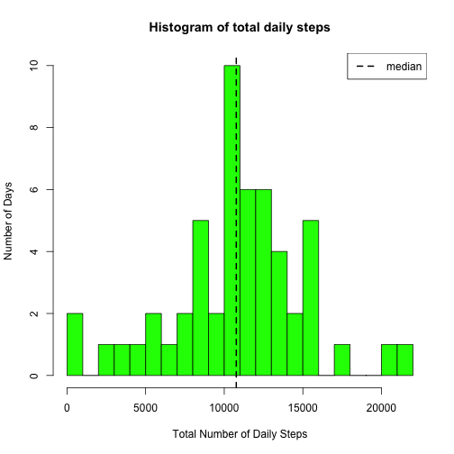
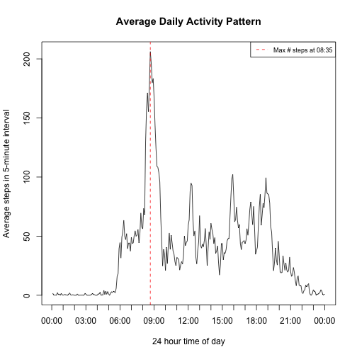
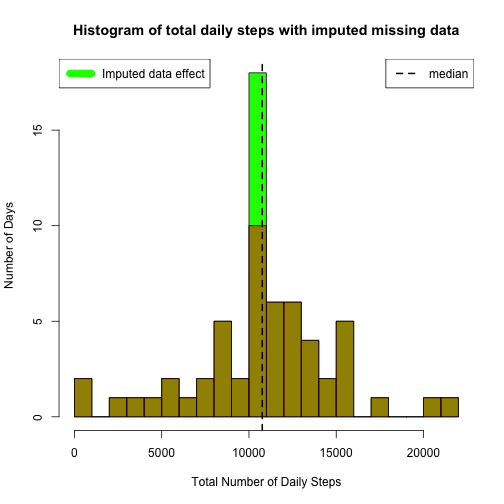
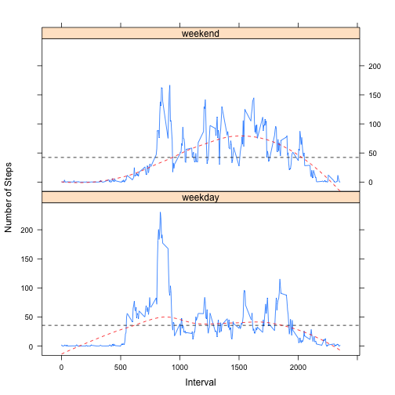

# Reproducible Research: Peer Assessment 1


## Loading and preprocessing the data


```r
# read in CSV data
data.raw <- read.csv("activity.csv", sep=",", header=TRUE)
# convert raw data to a data table
library(data.table)
data.all <- data.table(data.raw)
# convert date column to POSIXct date object
data.all$date <- as.POSIXct(strptime(data.all$date, "%Y-%m-%d"))
# convert integer interval to a 4-character 0-filled string
data.all$interval <- sprintf("%04d", data.all$interval)
head(data.all)
```

```
##    steps       date interval
## 1:    NA 2012-10-01     0000
## 2:    NA 2012-10-01     0005
## 3:    NA 2012-10-01     0010
## 4:    NA 2012-10-01     0015
## 5:    NA 2012-10-01     0020
## 6:    NA 2012-10-01     0025
```

```r
# identify complete cases without NAs
data <- data.all[complete.cases(data.all)]
head(data)
```

```
##    steps       date interval
## 1:     0 2012-10-02     0000
## 2:     0 2012-10-02     0005
## 3:     0 2012-10-02     0010
## 4:     0 2012-10-02     0015
## 5:     0 2012-10-02     0020
## 6:     0 2012-10-02     0025
```

## What is mean total number of steps taken per day?


```r
# sum up daily steps
daily.steps <- tapply(data$steps, data$date, sum)
daily.steps.mean <- mean(daily.steps, na.rm=TRUE)
daily.steps.median <- median(daily.steps, na.rm=TRUE)
```

The __mean__ number of daily steps is __10766.19__.

The __median__ number of daily steps is __10765.00__.


```r
# draw histogram of average daily steps
hist(daily.steps, breaks=25, col="green",
     main="Histogram of total daily steps", 
     xlab="Total Number of Daily Steps", 
     ylab="Number of Days")
# add median line
abline(v=daily.steps.median, lty=2, lwd=2, col="black")
legend("topright", legend=c("median"), lty=2, lwd=2, col="black")
```

 

## What is the average daily activity pattern?


```r
# generate daily means for each 5-minute time interval
data.interval.step.means <- tapply(data$steps, data$interval, mean)
# get the maximum number of steps for any interval during the day
max.steps <- data.interval.step.means[
    data.interval.step.means==max(data.interval.step.means)]
max.step.period <- strftime(strptime(names(max.steps), "%H%M"), format="%H:%M")
```

The __maximum__ mean number of steps during a 24-hour period was
__206.17__ at __08:35__.


```r
# generate list of POSIX time objects of unique 5-minute intervals
# - this is used for labaling the x-axis in the line plot
x.intervals <- strptime(names(data.interval.step.means), "%H%M")
# plot the average number of steps for 5-minute intervals in a 24-hour period
plot(data.interval.step.means, type = "l", xaxt='n',
     main="Average Daily Activity Pattern",
     xlab="24 hour time of day",
     ylab="Average steps in 5-minute interval")
# create individual labels, one every hour
xlabels <- seq(x.intervals[1], x.intervals[length(x.intervals)]+300, by=3600)
# generate label locations
# - based on every 12th interval item to correspond to a 1 hour period,
#   i.e., 12 5-minute intervals = 1 hour
xat <- seq(0, length(data.interval.step.means), by=12)
# add the axis to the plot
axis(side=1, at=xat, labels=strftime(xlabels, format="%H:%M"))
# get list index (x-axis location) of the maximum value
max.steps.idx <- which.max(data.interval.step.means)
# draw line to show interval with the maximum mean number of steps
abline(v=max.steps.idx, lty=2, lwd=1, col="red")
legend.text <- paste("Max # steps at", max.step.period)
legend("topright", legend=c(legend.text), lty=2, lwd=1, col="red", cex=0.75)
```

 

## Imputing missing values

<!--
1. Calculate and report the total number of missing values in the dataset 
(i.e. the total number of rows with NAs)
-->


```r
n.rows.all <- dim(data.all)[1]
n.rows.good <- dim(data)[1]
n.nas <- n.rows.all - n.rows.good
pct.nas <- round(100 * n.nas / n.rows.all, 1)
```

The number of rows with NAs is __2304__ which is 13.1% of all data
rows.

<!--
2. Devise a strategy for filling in all of the missing values in the 
dataset. The strategy does not need to be sophisticated. For example, you could 
use the mean/median for that day, or the mean for that 5-minute interval, etc. 
-->

Missing step data points will be replaced with the __mean__ value for that
interval for all non-missing values.


```r
# copy data with NAs to another table before modifying NAs
data.test <- data.all
# replace each instance of NA steps with the mean value for that 5-minute
# interval from all non-NA rows.
for (i in 1:nrow(data.all)) {
    if (is.na(data.all[i,]$steps)) {
        d.mean <- data.interval.step.means[data.all[i,]$interval]
        data.test[i,]$steps <- round(d.mean)
    }
}
# generate daily means for each 5-minute time interval
data.test.interval.step.means <- tapply(data.test$steps, data.test$interval, 
                                        mean)
# get the maximum number of steps for any interval during the day
max.test.steps <- data.test.interval.step.means[
    data.test.interval.step.means==max(data.test.interval.step.means)]
max.test.step.period <- strftime(strptime(names(max.test.steps), "%H%M"),
                                 format="%H-%M")
```

The __maximum__ mean number of steps during a 24-hour period was
__206.15__ at
__08-35__.


```r
# sum up daily steps
daily.test.steps <- tapply(data.test$steps, data.test$date, sum)
daily.test.steps.mean <- mean(daily.test.steps, na.rm=TRUE)
daily.test.steps.median <- median(daily.test.steps, na.rm=TRUE)

n.test.steps.total <- sum(daily.test.steps)
n.steps.total <- sum(daily.steps)
```

The __mean__ number of daily steps is
__10765.64__.

The __median__ number of daily steps is
__10762.00__.


```r
# draw histogram of average daily steps
hist(daily.test.steps, breaks=25, col="green",
     main="Histogram of total daily steps with imputed missing data", 
     xlab="Total Number of Daily Steps", 
     ylab="Number of Days")
# overlay histogram of data with NAs removed
hist(daily.steps, add=T, breaks=25, col=rgb(1, 0, 0, 0.5))
legend("topleft", c("Imputed data effect"), col=c("green"), lwd=10)
# add median line
abline(v=daily.test.steps.median, lty=2, lwd=2, col="black")
legend("topright", legend=c("median"), lty=2, lwd=2, col="black")
```

 

Replacing NAs with mean values for the interval __increases__ the total number
of days with the mean number of steps, and the overall number of steps taken
during the complete period of the data.

Replacing NAs with mean values for the interval has minimal effect on the mean
of the total number of daily steps. The __maximum__ mean number of steps during
a 24-hour period with data imputation was
__206.17__ at __08:35__.


```r
delta.means <- data.interval.step.means - data.test.interval.step.means
s <- summary(delta.means)
```

Missing data imputation based on the mean value of each 5-minute period
alters the average number of steps by __0.0019__ during each period.


```r
par(mar=c(4,0,2,0), oma=c(1,1,0,1))
boxplot(delta.means, horizontal=TRUE,
        main="Effect of imputing missing data",
        xlab=expression(paste(Delta, " mean")))
```

 

## Are there differences in activity patterns between weekdays and weekends?

<!--
Create a new factor variable in the dataset with two levels – “weekday” and “weekend” indicating whether a given date is a weekday or weekend day.
-->


```r
# create a weekday vs. weekend factor
data.test$wkd <- as.factor(ifelse(weekdays(data.test$date) %in% c("Saturday",
                "Sunday"), "weekend", "weekday"))
# create a data frame dith weekday factor
data.bywkd <- aggregate(data.test$steps, by=list(interval=data.test$interval, 
                                                 wkd=data.test$wkd), FUN=mean)
# convert interval values (string at this point) to integer values
# to enable plotting with lattice xyplot.
data.bywkd$interval <- strtoi(data.bywkd$interval, 10L)
# plot weekday data with lattice xyplot
library(lattice)
xyplot(x ~ interval | wkd, type="l",
       data=data.bywkd, layout = c(1, 2),
       panel=function(x, y, ...) {
           panel.xyplot(x, y, ...)
           panel.abline(h = mean(y), lty=2) # add means
           panel.loess(x, y, degree=2, span=2/3, lty=2, col="red")
       },
       xlab="Interval", ylab="Number of Steps" )
```

 


```r
wkd.means <- tapply(data.bywkd$x, data.bywkd$wkd, mean)
wkd.max <- tapply(data.bywkd$x, data.bywkd$wkd, max)
```

The activity differs between weekends and weekdays by the mean number of steps
per interval, __42.3646__ on weekends and
__35.6086__ on weekdays. Weekends, therefore, tend to be more
active throughout the day.

On the other hand, the maximum number of steps in a single interval, is
significantly higher during weekdays, __230.3556__ vs.
__166.625__.

###### End of report.
